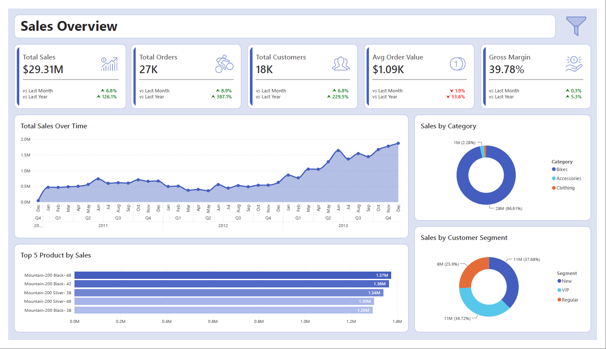

# Retail Sales Analytics & Reporting — T-SQL & Power BI Dashboard

> Advanced SQL-based analysis on top of a Gold Layer data warehouse, from data exploration to customer/product reports and a Power BI Sales Overview dashboard, turning warehouse data into decision-ready insight.

---

## 📑 Table of Contents

- [Business Background](#-business-background)
- [Business Objective](#-business-objective)
- [Data Overview](#-data-overview)
- [Approach and Methodology](#-approach-and-methodology)
- [Key Findings](#-key-findings)
- [Business Impact and Recommendations](#-business-impact-and-recommendations)
- [Tools & Tech Stack](#%EF%B8%8F-tools--tech-stack)
- [Repository Structure](#-repository-structure)
- [Related Project](#-related-project)
- [Author](#-author)

---

## 📌 Business Background

A clean, well-modeled data warehouse is necessary but not sufficient. A Star Schema by itself doesn't tell a stakeholder how sales are trending, which products are winning, or which customers are worth prioritizing. That gap between "the data is ready" and "the business has answers" is where this project sits: turning warehouse data into structured analysis and a reporting layer stakeholders can actually use.

## 🎯 Business Objective

Using the Gold Layer from the [Retail Sales Data Warehouse](#-related-project) project, this analysis aims to:
- Explore the data's structure, dimensions, and time coverage to understand what it can answer
- Quantify performance through measures, magnitude, and ranking analysis
- Track how key metrics change over time, including YoY and MoM performance
- Segment customers and products into actionable categories
- Produce reusable **customer and product reports**, and a **Power BI dashboard** for ongoing self-serve monitoring

## 📂 Data Overview

| Attribute | Details |
|---|---|
| Source | Gold Layer of the Retail Sales Data Warehouse (Star Schema) |
| Core tables | Sales Fact, Customer Dimension, Product Dimension |
| Language | T-SQL (SQL Server) |

## 🔧 Approach and Methodology

The analysis progresses from foundational exploration to business-ready reporting:

```
Database, Dimension & Date Range Exploration    → Understand structure & time coverage
        ↓
Measures, Magnitude & Ranking Analysis          → Quantify and rank top-performing products/customers
        ↓
Change Over Time, Cumulative & Performance      → Track trends, running totals, YoY/MoM performance
Analysis (T-SQL)
        ↓
Data Segmentation & Part-to-Whole Analysis      → Group customers/products into meaningful categories
        ↓
Customer & Product Reports                      → Reusable SQL views summarizing key behaviors/metrics
        ↓
Power BI Dashboard                              → Visual, self-serve Sales Overview for stakeholders
```

## 🔍 Key Findings

The resulting Power BI **Sales Overview** dashboard surfaces:



- **Bikes dominate the sales mix**, accounting for the vast majority of total sales, Accessories and Clothing together make up only a small fraction of revenue
- **Sales are fairly evenly split across customer segments** (VIP, New, and Regular), suggesting no single segment currently dominates revenue, each represents a meaningful share worth targeting differently
- **The Mountain-200 series dominates the top-selling products**, with several color/size variants clustering near the top of the ranking by sales value
- Total sales show a **clear upward trend over the covered period**, visible in the Total Sales Over Time trend

## 💡 Business Impact and Recommendations

**1. Category concentration is a risk worth addressing**
With Bikes driving the overwhelming majority of revenue, the business is exposed if demand in that category softens. Recommend using Accessories and Clothing as cross-sell opportunities at checkout to diversify revenue rather than relying almost entirely on one category.

**2. Use the customer segment split to guide differentiated marketing**
Since VIP, New, and Regular customers each contribute a meaningful share of sales, a one-size-fits-all marketing approach leaves value on the table, mirroring the segmentation approach used in the [Customer Segmentation project](https://github.com/farhanfdlh/customer-segmentation-project), the business should tailor retention offers for VIP customers, onboarding nudges for New customers, and win-back campaigns for lapsing Regular customers.

**3. Protect and monitor top-selling products closely**
Because sales are concentrated in a handful of Mountain-200 variants, these products should be prioritized in inventory planning and supply chain monitoring. A stockout on a top performer would have an outsized impact on total revenue.

**4. Operationalize the dashboard for recurring business reviews**
With YoY/MoM performance tracking already built into the analysis, the Power BI dashboard is ready to support a recurring (e.g., monthly) business review cadence, reducing the need for ad hoc reporting requests.

## 🛠️ Tools & Tech Stack

| Tool | Purpose |
|---|---|
| SQL Server (T-SQL) | Core language for exploration, analysis, and report views |
| SQL Server Management Studio (SSMS) | Database GUI |
| Power BI | Interactive Sales Overview dashboard |

## 📂 Repository Structure

```
data-analytics-project/
│
├── dashboard/     # Power BI file containing a sales overview dashboard
├── docs/          # Additional project documentation
├── scripts/       # SQL scripts for data exploration & analysis
└── README.md
```

## 🔗 Related Project

This analysis is built directly on top of the Gold Layer produced in: **[Retail Sales Data Warehouse — ETL Pipeline & Star Schema](https://github.com/farhanfdlh/data-warehouse-project)**.

## 👤 Author

**Farhan Fadhilah Rasyid**

[](https://github.com/farhanfdlh)
[](https://www.linkedin.com/in/farhan-fadhilah-rasyid)
[](https://farhan-portfolio-smoky.vercel.app)
